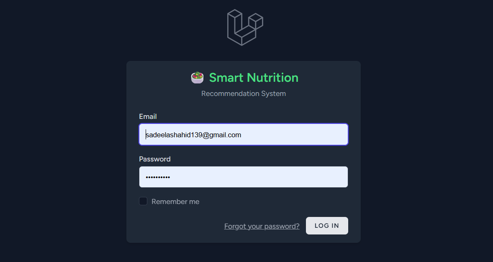
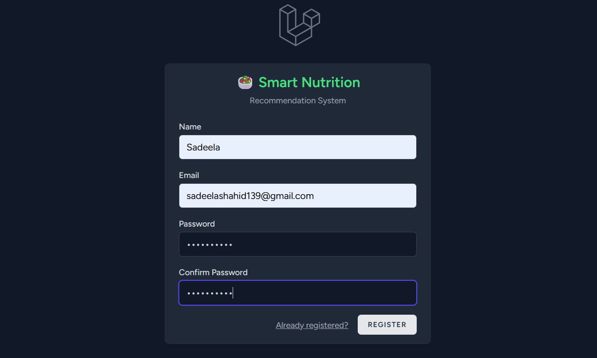
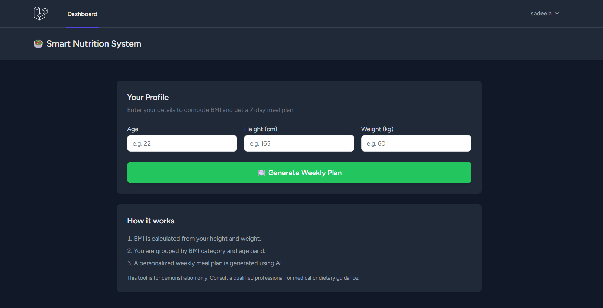

# 🥗 Smart Nutrition Recommendation System

**Your Health, Your Plan** — An AI-powered nutrition web application built with Laravel.

Users can register, enter their health details, get BMI analysis, and receive a personalized 7-day meal plan generated by AI — all from a single responsive web interface.

---

## Screenshots

### Login Page


### Register Page


### Dashboard


### Meal Plan Result


### Print Pamphlet


---

## Table of Contents

- [Features](#features)
- [Tech Stack](#tech-stack)
- [Requirements](#requirements)
- [Installation](#installation)
- [How to Run](#how-to-run)
- [How to Use](#how-to-use)
- [Project Structure](#project-structure)
- [Routes](#routes)
- [Database](#database)
- [GitHub Push (GitHub Desktop)](#github-push-github-desktop)
- [Troubleshooting](#troubleshooting)

---

## Features

| Feature | Description |
| ---------------------- | -------------------------------------------------------------------- |
| **Authentication** | User registration, login, logout with session |
| **BMI Calculator** | Calculates BMI from height and weight |
| **BMI Categories** | Underweight, Normal, Overweight, Obese classification |
| **AI Meal Plan** | 7-day personalized meal plan generated using Google Gemini AI |
| **Print Pamphlet** | Beautiful printable meal plan with green theme |
| **Input Validation** | Error messages for invalid or negative inputs |
| **Responsive UI** | Tailwind CSS, dark mode supported |

---

## Tech Stack

- **Backend:** PHP 8.2, Laravel 12
- **Database:** MySQL (XAMPP)
- **Frontend:** Blade Templates, Tailwind CSS
- **AI Integration:** Google Gemini API (gemini-2.0-flash)
- **Server:** Laravel Artisan (`php artisan serve`)

---

## Requirements

Install these before running the project:

| Tool | Version |
| -------- | ------------------------- |
| PHP | 8.2+ |
| Composer | Latest |
| MySQL | 5.7+ (XAMPP recommended) |
| Node.js | Required (for Vite/CSS) |

---

## Installation

### 1. Clone or download the project

```
git clone <your-repo-url>
cd smart-nutrition
```

### 2. Install PHP dependencies

```
composer install
```

### 3. Install Node dependencies

```
npm install
```

### 4. Setup environment file

```
copy .env.example .env
php artisan key:generate
```

### 5. Configure database

Open `.env` and update these lines:

```
DB_CONNECTION=mysql
DB_HOST=127.0.0.1
DB_PORT=3306
DB_DATABASE=smart_nutrition
DB_USERNAME=root
DB_PASSWORD=
```

### 6. Add Gemini API Key

In `.env` file add at the bottom:

```
GEMINI_API_KEY=your_api_key_here
```

Get your free API key from: https://aistudio.google.com/apikey

### 7. Create MySQL database

Start MySQL from XAMPP, then open phpMyAdmin and create database named `smart_nutrition`.

### 8. Run migrations

```
php artisan migrate
```

---

## How to Run

### Step 1 — Start XAMPP

Open **XAMPP Control Panel** → click **Start** next to **Apache** and **MySQL**.

### Step 2 — Start Laravel server

```
cd smart-nutrition
php artisan serve
```

Output:
```
Server running on [http://127.0.0.1:8000]
```

### Step 3 — Start Vite (CSS/JS)

Open a **second CMD window**:

```
cd smart-nutrition
npm run dev
```

### Step 4 — Open in browser

| Page | URL |
| --------- | --------------------------------- |
| Login | http://127.0.0.1:8001/login |
| Register | http://127.0.0.1:8001/register |
| Dashboard | http://127.0.0.1:8001/dashboard |

> Dashboard requires login. Register first, then login.

### Stop server

Press `Ctrl + C` in the terminal.

---

## How to Use

1. **Register** — Go to `/register` and create an account
2. **Login** — Sign in with your email and password
3. **Dashboard** — Enter your Age, Height (cm), and Weight (kg)
4. **Generate Plan** — Click "Generate Weekly Plan" button
5. **View Results** — See your BMI, BMI category, and 7-day meal plan
6. **Print** — Click "Print Meal Plan" to get a beautiful printable pamphlet
7. **Logout** — End your session securely

---

## Project Structure

```
smart-nutrition/
│
├── app/
│   ├── Http/Controllers/
│   │   ├── MealPlanController.php    # BMI + AI meal plan generation
│   │   └── ProfileController.php     # User profile management
│   └── Models/
│       ├── User.php
│       └── MealPlan.php
│
├── database/migrations/              # Database schema
├── resources/views/
│   ├── dashboard.blade.php           # BMI form page
│   ├── meal-result.blade.php         # Results + print page
│   └── auth/
│       ├── login.blade.php
│       └── register.blade.php
├── routes/web.php                    # All application routes
├── .env                              # Environment config (do NOT push to GitHub)
└── README.md
```

---

## Routes

| Method | URL | Auth | Description |
| ------ | ------------------- | ---- | -------------------------- |
| GET | `/login` | No | Login page |
| POST | `/login` | No | Login submit |
| GET | `/register` | No | Register page |
| POST | `/register` | No | Register submit |
| POST | `/logout` | Yes | Logout |
| GET | `/dashboard` | Yes | BMI form page |
| POST | `/generate-plan` | Yes | Generate meal plan |
| GET | `/meal-result/{id}` | Yes | View meal plan result |
| GET | `/profile` | Yes | Edit profile |

---

## Database

### Tables

| Table | Purpose |
| ------------ | ------------------------------------ |
| `users` | Registered users |
| `meal_plans` | Generated meal plans with BMI data |
| `sessions` | User sessions |
| `cache` | Application cache |
| `jobs` | Queue jobs |

### meal_plans table fields

- `user_id` — linked to users table
- `age` — user age
- `height` — height in cm
- `weight` — weight in kg
- `bmi` — calculated BMI value
- `bmi_category` — Underweight / Normal / Overweight / Obese
- `meal_plan` — 7-day AI generated meal plan text

---

## GitHub Push (GitHub Desktop)

### First time push

1. Open **GitHub Desktop**
2. Go to **File → New repository**
3. Set:
   - **Name:** `smart-nutrition`
   - **Local path:** `C:\xampp\htdocs\smart-nutrition`
   - **Git ignore:** Laravel
4. Click **Create repository**
5. Write commit message: `Initial commit - Smart Nutrition System`
6. Click **Commit to main**
7. Click **Publish repository**
8. Choose **Private** or **Public**
9. Click **Publish**

### Push future changes

1. Open GitHub Desktop
2. Review changed files on the left
3. Write a commit message
4. Click **Commit to main**
5. Click **Push origin**

> **Warning:** Never push `.env` file to GitHub. It contains your Gemini API key and database credentials. Laravel `.gitignore` already excludes it.

---

## Troubleshooting

### MySQL connection error

```
SQLSTATE[HY000] [2002] No connection could be made
```

**Fix:** Start MySQL from XAMPP Control Panel.

---

### CSS not loading (plain page)

**Fix:** Run in a separate CMD window:

```
npm run dev
```

---

### Port 8000 already in use

```
php artisan serve --port=8001
```

Open: http://127.0.0.1:8001/login

---

### Clear cache

```
php artisan config:clear
php artisan cache:clear
php artisan view:clear
```

---

### Meal plan not generating

Check your Gemini API key in `.env` file:

```
GEMINI_API_KEY=your_key_here
```

---

## Quick Commands

```
# Navigate to project
cd C:\xampp\htdocs\smart-nutrition

# Start server
php artisan serve

# Start CSS/JS
npm run dev

# Run migrations
php artisan migrate

# Fresh migration (delete all data)
php artisan migrate:fresh

# Clear config
php artisan config:clear

# Generate app key
php artisan key:generate
```

---

## Author

Smart Nutrition Recommendation System — Laravel + AI Application

## License

MIT License — Free for educational use.
